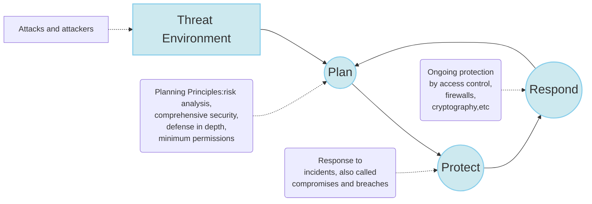
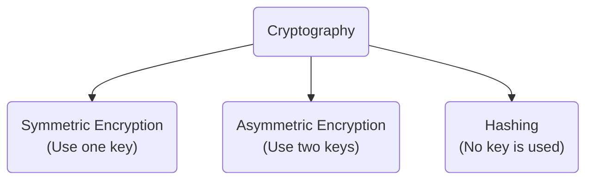
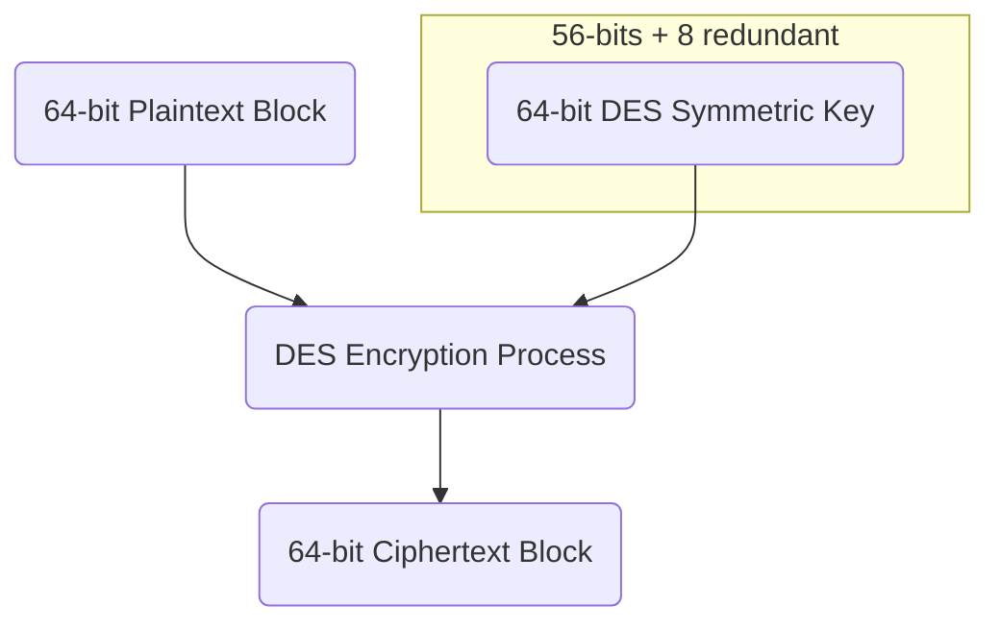

# SLD 1: INTRODUCTION TO CYBER SECURITY

**Confidentiality**, **integrity** and **availability**, (known as CIA triad), are considered the *three most important concepts within cyber security*.

**Confidentiality** means to prevent the **unauthorized access/sharing of data**.

**Integrity** means data **must not be changed** by unauthorized people.

**Availability** means information should be **consistently and readily accessible for authorized parties**.

Internet has **THREE CHARACTERISTICS** that aid cyber-Attacks

1. AUTOMATION
2. ACTION AT A DISTANCE
3. ELECTRONIC TECHNIQUES EASILY TRANSFERABLE/DUPLICATED

**MALWARE ATTACK**(恶意软件攻击)

“Malware” refers to malicious software including viruses, worms, spyware, ransomware, adware, Rootkits, and trojans.

Difference between VIRUS and WORM: **Virus** is malicious program that replicates itself and infects computers, however it needs a host to travel, while **worm** doesn’t require a host.

**Botnet** refer to the network of computers that are installed with malicious codes.

**Phishing** attacks are one of the most prominent widespread types of social engineering cyberattacks, wherein an attacker impersonates to be a trusted contact and sends the victim fake mails.

**Password attack** is a form of attack wherein a hacker cracks your password with various
programs and password cracking tools for illegal use. Dictionary attack, Brute force, Keylogger, Shoulder surfing, Rainbow table.

**Denial-of-Service (DoS) Attack** is a significant threat to companies. Here, attackers target systems, servers, or networks and flood them with traffic to exhaust their resources and bandwidth or crashes their system.

**COOKIES** in internet attacks

**First-party cookie** are issued by a website that a user views directly.

- Cannot contain a virus or steal personal information stored on a hard drive

**Third-party cookie** are not created by the website being visited, but rather by someone else. 

- Can pose a privacy risk

**Authentication** is the process used to ensure that an individual is who they claim to be.

# SLD 2: CYBER SECURITY PLANNING, EDUCATION, AWARENESS AND COMPLIANCE

#### POLICY-BASED SECURITY

**Cyber security policy** is a set of guidelines and procedures that an organization puts in place to protect its assets and data to prevent cyber attacks and threats.

Planners create policies, which specify **what to do** but **not how to do it**.

**Implementation guidance** goes beyond pure “what” by constraining to some extent the “how”.Implementation Guidance has two forms.

- **Standards MUST** be followed by implementers.

- **Guidelines SHOULD** be followed but are optional.

**Oversight** checks that policies are being implemented successfully.

Good implementation + Good oversight = Good protection

~~~mermaid
graph TD
	A("Policy(What)") --> B(Implementation Guidance: Standards and Guidelines)
    A --> B2(Oversight: Auditing, Log Files, Vulnerability Analysis)
    B --> C("Implementation(How)")
    B2 --> C
	C --> D(Protection)
~~~

#### HUMAN FACTORS IN CYBER SECURITY

**Employee behavior** is a critical concern in ensuring the security of computer systems and information assets.

**Security training program** is designed to teach people the skills to perform
their IT-related tasks more securely.

**Social Engineering** is about <u>Distraction</u> and <u>Misdirection</u>

**Phishing**: When Scammers fool you to think they are someone you trust in order to make you do something.

**Ransomware**: When criminals hack your computer or network, lock you out, and demand a ransom to let you back in.

#### How to Start a Cybersecurity Compliance Program

1. Creating a Compliance Team
2. Setting Up a Risk Analysis Process
3. Setting Controls
4. Creating Policies
5. Monitoring and Quick Response

When hackers exploits software vulnerabilities, organizations usually release a software security update intended to cover those vulnerabilities. The program released for this purpose is called a **<u>Patch</u>**(打补丁)

**<u>Masquerading</u>** is the fabrication(制造) of information that is purported(主旨) to be from someone who is not actually the author.

What is a computer virus?
A. Any program that is downloaded to your system without your permission
<u>**B. Any program that self-replicates**</u>
C. Any program that causes harm to your system
D. Any program that can change your Windows Registry

What is spyware?
A. Any software that monitors your system
B. Only software that logs keystrokes
<u>**C. Any software used to obtain covert information**</u>
D. Only software that monitors what websites you visit

When a hacking technique uses persuasion and deception to get a person to provide information to help them compromise security, this is referred to as what?
**<u>A. Social engineering</u>**
B. Masquerading
C. Human intelligence
D. Soft hacking

# SLD 3: ACCESS CONTROL AND BIOMETRIC BASED CYBER SECURITY SOLUTIONS

#### RULES FOR CHOOSING GOOD PASSWORDS

- Easy to remember, difficult to guess.

- Length – 6 to 9 characters.
- Mix character types.
  - Letters, digits, special characters.
- Use an acronym.
- Avoid dictionary words.
- Different account -> different password.
- Change passwords regularly.

#### FORMS OF AUTHENTICATION

**Biometrics** mean Automated methods of verifying or recognizing the identity of a living person based on physiological or behavioural characteristics.

There are two ways of determining if you are you ...

1. **IDENTIFICAION**
   - Establishing a person's identity – Who are you?
   - One to many comparison.

2. **VERIFICATION**
   - Involves confirming or denying a person’s claimed identity - Are you who you claim to be?
   - One to one comparison

There are two basic biometrics processes: **enrollment** and **authentication**.

#### TYPES OF BIOMETRIC

There are two categories of biometric technologies:

- **Physiological**: These mainly consist of **fingerprints**, the shape of the hand, vein    pattern, the eye (**iris** and **retina**), and the shape of the **face**.
- **Behavioral**: The most common are voice recognition, signature dynamics (speed of movement of pen, accelerations, pressure exerted etc.), keystroke, voice, gestures, etc.
- *Physiological are usually considered to offer the benefit of remaining more stable.*

#### BIOMETRICS ERROR RATES

Each biometrics solution has *three associated error rates*:

1. **False rejection rates** (FRRs), known as Type I errors, are the rate at which an authentication *system fails to verify the identity of an authorized user.*
2. A Type II error, the **false acceptance rate** (FAR), is the rate at which the authentication *system incorrectly authenticates unauthorized users.*
3. The crossover error rate, or **CER**, is the point at which the FAR and the FRR are the same.

#### BIOMETRIC ERRORS AND DECEPTION

**ERRORS**: when subject is not trying to fool the system
**DECEPTION**: when subject is trying to fool the system

# SLD 4: CRYPTOGRAPHY, DIGITAL SIGNATURE AND DIGITAL CERTIFICATES

#### CRYPTOGRAPHY

**CRYPTOGRAPHY**: is the art and science of secret writing, encrypting, or hiding of information from all but the intended recipient.
**CRYPTANALYSIS**: is the process of attempting to break a cryptographic system and return the encrypted message to its original form.

**BASIC DEFINITIONS**

- **PLAINTEXT**: A piece of data that is not encrypted
- **CIPHERTEXT**: The output of an encryption algorithm
- **CIPHER**: A cryptographic algorithm
- **KEY**: A sequence of characters or bits used by an algorithm to encrypt or decrypt a message
- **ENCRYPTION**: Changing plaintext to ciphertext
- **DECRYPTION**: Changing ciphertext to plaintext

#### TYPES OF CRYPTOGRAPHY

#### CAESAR’S CIPHER

**Caesar’s cipher** uses an algorithm and a key

- The algorithm specifies that you offset the alphabet either to the right (forward) or to the left (backward)
- The key specifies how many letters the offset should be.

#### SECRET-KEY CRYPTOGRAPHY (SKC)

A single key is used to encrypt and decrypt in both directions

POPULAR SYMMETRIC ENCRYPTION ALGORITHMS: **DES, 3DES, AES**, CAST, RIVEST, Blowfish, IDEA

#### DATA ENCRYPTION STANDARD (DES)

The request specified the following set of design criteria:

- The cryptographic algorithm **must be secure** to a high degree.
- The details of the algorithm **should be** described in an easy-to-understand language.
- The **security** of the algorithm must depend on the key, not on keeping the method itself (or parts of it) secret.
- The details of the algorithm must be **publicly available**, so that anyone could implement it in software or hardware.
- The method **must be adaptable** for use **in many applications**.
- Hardware **implementation** of the algorithm **must be practical**.
- The method **must be efficient** (i.e., fast and with reasonable memory requirements).
- It **should be possible to test and validate the algorithm under real-life**
  **conditions**.

The DES cipher encrypts messages 64 bits at a time.

The DES cipher (in codebook mode) needs two inputs.

#### USE DOUBLE DES (2 DES)

Use DES twice, with two keys (2x56 = 112 bits)

With **two pair of keys** of known plain-text/cipher-text, double **DES can be guessed with very high confidence**, for roughly <u>same computational complexity</u> as breaking DES itself.

#### USE DES THRICE (3DES)

Multiple encryption – goes through the DES algorithm three times.

It is **three times slower** than regular DES but can be **billions of times more secure** if used properly.

3DES is **stronger than DES but has similar weakness**.

The **longer key length makes it more resistant** to brute force attacks.

#### AES (ADVANCED ENCRYPTION STANDARD)

Originally called Rijndael.

AES **is a block cipher that separates data input into 128-bit blocks**.

AES can have **key sizes of 128, 192, and 256 bits**, with the size of the key affecting the number of rounds used in the algorithm.

#### RC4

1. RC4 is **extremely fast and uses only a small amount of RAM**.

2. RC4 **can use a broad range of key lengths**.

One way to see why **RC4 is fast** is to note that RC4 **can be implemented in only about 50 lines of code**. In contrast, the gold-standard **AES algorithm requires 350 lines of code**.

#### MAJOR SYMMETRIC KEY ENCRYPTION CIPHERS

#### PUBLIC KEY CRYPTOGRAPHY

##### PUBLIC KEY (ALSO KNOWN AS ASYMMETRIC-KEY )ENCRYPTION

- Uses **two different but related keys**
- Either key can encrypt or decrypt message
- If **Key A encrypts message, only Key B can decrypt**
- Highest value when **one key serves as private key** and the **other serves as public key**

##### PUBLIC KEY ALGORITHMS

**DIFFIE-HELLMAN**, El-Gamal, **RSA** and Elliptic Curve(ECC)

##### PUBLIC KEY ENCRYPTION EXAMPLE

**The two main uses for public** key cryptography are:

- **PUBLIC KEY ENCRYPTION**: A *message encrypted with* a recipient's *public key cannot be decrypted by anyone except a possessor* of the matching private key. This is used to attempt to ensure confidentiality.
- **DIGITAL SIGNATURES**: *A message signed with a sender's private key can be verified by anyone who has access to the sender's public key*, and, therefore, *is likely to be the person associated with the public key used.*

#### DIFFIE-HELLMAN KEY EXCHANGE

It is a Public Key Algorithm **only for Key Exchange** and **Does NOT Encrypt or Decrypt the message.**

The protocol is one of the **most common encryption** protocols in use today.

##### USED FOR

- Electronic **key exchange** method of the Secure Sockets Layer (**SSL**) protocol
- Enables the *sharing of a secret key between two people who have not contacted each other before*.

#### RSA ALGORITHM

RSA is a public-key cryptosystem that MIT professors Ronald L. **R**ivest, Adi **S**hamir and Leonard M. **A**dleman developed in 1977.

The system is based on several mathematical principles in number theory.

RSA **obtains its security from the difficulty of factoring large numbers**(大素数分解问题).

##### USED FOR

- TO ENCRYPT A MESSAGE M THE SENDER
- TO DECRYPT THE CIPHERTEXT C THE OWNER

##### COMPARABLE KEY SIZES FOR EQUIVALENT SECURITY

#### PUBLIC KEY + SYMMETRIC

**PROBLEM**: *Public key systems are powerful but slow*, while *symmetric systems are inflexible but fast*.

**SOLUTION**: A *hybrid system*!

- Sender generates random symmetric session key
- Sender encrypts session key using PK crypto
- Sender encrypts message using session key (and symmetric cipher)

**RESULT**: A fast, flexible system

#### DIGITAL SIGNATURES

A **digital signature** (“digital thumbprint”) **is a message digest used to** cryptographically **sign a message**.

Digital signatures **rely on** asymmetric (**public key**) cryptography.

To create a digital signature, **you sign the message with your private key**.

- Only private-key holder can compute signatures.

##### HASHING

It is very **similar to encryption** and is used to make sure that the information was not modified by the attacker.

- Can be applied to a block of data of any size
- Produces a fixed-length output
- H(x) is relatively easy to compute for any given x

#### DIGITAL SIGNATURE(WITH MESSAGE PROTECTION)

Digest means 信息摘要

#### DIGITAL CERTIFICATES & CERTIFICATE AUTHORITIES

A digital certificate is an electronic document, similar to a digital signature, attached to a file **certifying that this file is from the organization it claims to be** and has **not been modified from the original format**.

A **Certificate Authority(CA) is an agency** **that manages the issuance of certificates** and serves as the electronic notary public to verify their worth and integrity

**Digital certificate** includes:

- **Name** of subject/company
- Subject’s **public key**
- **Digital certificate** serial number
- **Expiration date, issuance date**
- **Digital signature of CA**

What is data encryption standard (DES)?
***A. Block cipher***
B. Stream cipher
C. Bit cipher
D. None of the above

There is no such thing as **certified encryption**

The **Diffie-Hellman algorithm** depends on the difficulty of computing discrete
logarithms for its effectiveness.

The **Diffie-Hellman** is a Public Key Algorithm only for Key Exchange and Does NOT Encrypt or Decrypt the message.

The principal attraction of **ECC** compared to **RSA** is that it appears to offer equal security for a far smaller bit size, thereby reducing processing overhead.

Because **serial numbers**(序列号) are unique within a CA, the serial number is sufficient
to identify the certificate.

# SLD 5: WEB SECURITY, FIREWALLS AND INTRUSION DETECTION

#### WEB SECURITY

Web is widely used by business, government and individuals. However, Internet & Web are **vulnerable as it uses HTTP protocol**.

The SSL (Secure Socket Layer, originated by Netscape) and TLS (Transport Layer Security) was designed for web security. First version of TLS can be viewed as an SSLv3.1

The terms SSL and TLS are often used interchangeably or in conjunction with each other (TLS/SSL), but one is in fact the predecessor of the other — SSL 3.0 served as the basis for TLS 1.0.

HTTPS: Secure HTTP protocol = HTTP + SSL

#### FIRE WALLS

A firewall is **hardware or software** (or a **combination** of hardware and software) that monitors the transmission of **packets** of digital information **that attempt to pass** through the perimeter or a network.

**When you request something** from the internet, the **firewall pretends that it made the request, not your computer.**

Since the **internet never** even **sees your computer**, there’s nothing for the worms or crackers to probe or attack other than your firewall.

And your **firewall is just a dumb box**.

#### PERSONAL FIREWALL

A personal firewall (sometimes called a desktop firewall) is a **software application used to protect a single Internet-connected computer** from intruders

#### PACKET FILTERING FIREWALLS

Packet filtering firewalls is **low cost and low impact on network performance**

**Three subsets** of packet filtering firewalls

- STATIC FILTERING
- DYNAMIC FILTERING
- STATEFUL INSPECTION

#### SPI FIREWALL

**Stateful Packet Inspection Firewalls (SPI)**: Reviews the same packet information but also records information about TCP connections.

Keeps track of each network connection established between internal and external systems using a state table.

Tracks the state and context of each packet in the conversation by recording which station sent what packet and when.

##### PERSPECTIVE ON SPI FIREWALL

- LOW COST
- SAFETY
- DOMINANCE

#### INTRUDERS

A significant security problem for networked systems is hostile/unwanted, trespass by users or software.

#### INTRUSION DETECTION

**Intrusion detection systems** are **designed** to **analyze** and **respond to** computer **attacks**.

**Firewalls drop provable attack packets only.**

Intrusion detection systems **(IDSs) look for suspicious traffic.**

**Cannot drop because** the **packet is merely suspicious.**

**Sends an alarm** message **if the attack appears to be serious.**

#### TYPES OF IDS

1. **Host-based** IDS (HIDS)
     - Examines activity only on a specific host
     - Flags that may raise the alarm in a HIDS
2. **Network-based** IDS (NIDS)
     - Network-Based IDS (NIDS) are **engines that parse network traffic**.
     - In addition to capturing all network traffic, NIDS compare the traffic with a set of pre-classified attack signatures.
     - Once a signature is found in a network packet, a protective action is launched, and the attack is stopped and logged.
     - NIDS engines can be easily deployed without suffering major network modifications.
3. **Distinguished** by detection method
     - **Signature-based** IDS - Relies heavily on a predefined set of attack and traffic patterns called signatures.
     - **Anomaly-based** (heuristic) IDS - Monitors activity and attempts to classify it as either “normal” or “anomalous.”

What can you do to your network firewall to help defend against DoS attacks?
A. Disallow all traffic that is not encrypted
***B. Disallow all traffic that comes from outside the network***
C. Disallow all traffic that comes from inside the network
D. Disallow all traffic that comes from untrusted sources

A **Firewall** is a network device that can be hardware, software, or a combination of both whose purpose is to enforce a security policy across its connections to external networks such as the Internet.

Some ***Stateful Packet Inspection (SPI)*** firewalls are able to examine the contents of packets as well as the headers for signs that they are legitimate.

A ***Stateful firewall***(Same to upwards☝SPI) maintains a ***State table***, which is a list of active connections.

A ***traditional packet filter*** makes filtering decisions on an individual packet basis and does not take into consideration TCP connection status

***Intrusion detection***(入侵检测, always IDS, S means system) is based on the assumption that the behavior of the intruder differs from that of a legitimate user in ways that can be quantified

***$False$*** Signature-based approaches attempt to define normal, or expected behaviour,whereas anomaly approaches attempt to define proper behaviour 

A ***host-based IDS*** monitors the characteristics of a single host and the events occurring within that host for suspicious activity

A ***network-based IDS*** monitors network traffic for particular network segments or devices and analyzes network, transport, and application protocols to identify suspicious activity

# SLD 6: PHYSICAL SECURITY AND PERSONNEL

#### HOW FILES ARE CREATED, DELETED, AND RESTORED

##### File Creation

When a file is created three things occur:

1. An **entry is made into the File Allocation Table** (FAT) to indicate where the actual data is stored in the Data Area.

2. A **Directory entry is made to indicate file name, size, the link to the FAT** and other info.

3. The **data is written to the Data Area**.

##### File Deletion

When a file is deleted only two things occur:

1. The **FAT entry for the file is zeroed** out and **the space on the hard drive becomes available** for use by a new file.
   
2. The **first character of the Directory entry file name is changed to a special character**.

**Nothing is done to the Data Area.**

##### File Restoration

When a file is restored only two things are done:
1. The **FAT entry for the file is linked again to the location in the data area where the file is stored**.
   
2. The **first character of the Directory entry file name is changed to a legal character.**

**Nothing is done to the Data Area.**

#### PHYSICAL SECURITY

**Physical** security **is also called infrastructure** security.

Protects the information systems that contain data and the people who use, operate, and maintain the systems

Must prevent any type of **physical access** or **intrusion** that can **compromise security**.

Protect physical assets that **support the storage and processing** of information.

Physical security **involves two complementary requirements**.

**First**, physical security **must prevent damage to the physical infrastructure** that sustains the information system. In broad terms, that **infrastructure includes the following**:

- **Information system hardware**
- **Physical facility**
- **Supporting facilities**
- **Personnel**

**Second**, **physical security must prevent misuse of the physical infrastructure, which** includes vandalism, theft, and unauthorized entry.

#### PHYSICAL SECURITY THREATS

It **refers to the types of physical situations** and occurrences **that can constitute a threat to information systems**.

Physical threats can be categorized into the following categories:
1. **Environmental threats**
2. **Technical threats**
3. **Human-caused threats**

#### SECURITY INCIDENT RESPONSE

- Some attacks inevitably succeed.
  - Successful attacks are called incidents or compromises.
  - Security moves into the respond stage.
- Response should be “reacting according to plan.”
  - Planning is critical.
  - A compromise is not the right time to think about what to do.
- Major Incidents and Response
  - Major incidents are incidents the on-duty security staff cannot handle.
  - Company must convene a computer security incident response team(CSIRT).
  - CSIRTs should include members of senior management, the firm’s security staff, members of the IT staff, members of affected functional departments, and the firm’s public relations and legal departments.
  - The Singapore Cyber Emergency Response Team (SingCERT) responds to cybersecurity incidents.

For large and medium-sized organizations, a computer security incident response team (**CSIRT**) **is responsible for rapidly detecting incidents, minimizing loss and destruction, mitigating the weaknesses that were exploited, and restoring computing services.**

#### INTEGRATED CYBER SECURITY STRATEGIES

Security strategies that are **technology-centric or policy-centric will fail.**

**Technology-centric strategies are weak without strong policies** and practices.

**Policy-centric strategies are ineffective without technology** to monitor and enforce them.

**What is needed** is a comprehensive multi faceted approach based on:

- SENIOR MANAGEMENT SUPPORT
- POLICIES
- PROCESSES
- TECHNOLOGIES

###### because **all four play a vital role** in the proper execution of a security program
